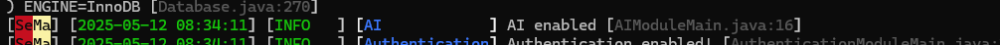
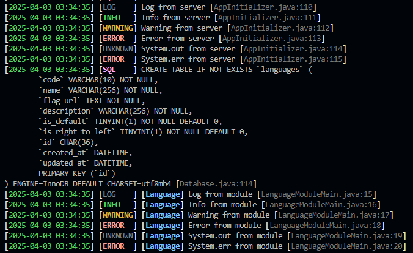

# SeMa - Module-oriented architecture for Java RestAPI
(This is my personal project, meaning it does not belong to my old company or my current University)

## Contents
- [Contents](#contents)
- [Getting started](#getting-started)
  - [Introduction](#introduction)
  - [Installation](#installation)
- [Project configuration](#project-configuration)
- [Creating a module](#creating-a-module)
  - [For Command line](#for-command-line-recommended)
  - [For Eclipse IDE](#for-eclipse-ide)
- [Exporting module](#exporting-module)
  - [For VSCode](#for-vscode)
  - [For Eclipse IDE](#for-eclipse-ide-1)
- [Logging](#logging)
- [Building a complete module (CRUD) step-by-step](#building-a-complete-module-crud-step-by-step)
  - [Generating a module](#generating-a-module)
  - [Creating an entity](#creating-an-entity)
  - [Creating a repository](#creating-a-repository)
  - [Creating a controller](#creating-a-controller)
  - [Creating a service for seeding database](#creating-a-service-for-seeding-database)

## Getting started
### Introduction
As the grow of a project, it become larger, more complexity, and harder to create a new feature or to maintain. And it may take much of time and effort to build and maintain.

### Installation
1. System requirement
   - [Java 21](https://www.oracle.com/java/technologies/downloads/#java21)
   - [Apache Tomcat 11](https://tomcat.apache.org/download-11.cgi)
   - [Maven](https://maven.apache.org/download.cgi)
2. Clone a Git repository from Github
   ```bash
   git clone --recurse-submodules https://github.com/vnexos/SeMa_BE.git
   ```
3. Setup the development environment by the path to the tomcat folder inside the `run.cmd` file (or `run.sh` file for linux)
   ```cmd
   REM Set the Tomcat folder path
   set CATALINA_HOME=D:\apache-tomcat-11.0.5
   ```
4. Run the project for the first time
   ```bash
   cd SeMa_main
   run
   ```
This command will build the project, copy target file to webapps folder inside tomcat and then run the tomcat.
## Project configuration
- The general settings for the project
  ```properties
  # the prefix of the API endpoint, the controller start with `/` will not be affected by the api prefix
  module.api-prefix=/api/v1
  # the folder contains all modules (`modules` is recommended)
  module.folder=modules
  # the development mode will allow the access from non-origin request like postman, ...
  module.development=true
  ```
- SQL settings
  ```properties
  # initialize the database at the startup of the server (recomment for development mode or running the server on production for the first time)
  sql.setup-on-start=true
  # The driver of database
  sql.driver=com.mysql.cj.jdbc.Driver
  # URL of database
  sql.url=jdbc:mysql://localhost:3306

  # Information of database 
  sql.db=vnexos
  sql.user=vnexos
  sql.pass=123123

  # Max allowed connection to database at the sametime
  sql.maxPoolSize=10
  ```
- Log settings
  ```properties
  # The folder contains log files (`logs` is recommended)
  log.folder=logs
  # The name of log file
  log.file=sema.log
  # The allowed log level for logging
  log.level=UNKNOWN|LOG|INFO|WARNING|ERROR|SQL|ROUTE

  # Show classpath in log line
  # 0 => Show nothing
  # 1 => Show only file (recommended)
  # 2 => Show function path only
  # 3 => Show both file and function path
  log.classpath=1

  log.show.brand=true
  # Show time in log line, `false` is not recommended
  log.show.time=true
  # Show log type in log line, `false` is not recommended
  log.show.type=true
  # Show module in log line, `false` is not recommended
  log.show.module=true
  ```
- CORS settings (use `*` for allowing all)
  ```properties
  # Allowed origins
  cors.origin=http://localhost:3000|http://localhost:3001
  # Allowed methods
  cors.method=GET|POST|PUT|PATCH|DELETE
  # Allowed headers
  cors.header=*
  # CORS Max age
  cors.max-age=3600
  # Allowing credentials
  cors.credentials=true
  ```
## Creating a module
### For Command line (recommended)
Execute maven command to create a module (replace `<...>` with the value). And we should use the Maven Archetype, use can see it [here](https://github.com/vnexos/SeMa_archetype/packages/2501333).

[](https://github.com/vnexos/SeMa_archetype/releases/latest)
```bash
mvn archetype:generate -DarchetypeGroupId=com.vnexos.sema -DarchetypeArtifactId=module-archetype -DarchetypeVersion=<latest-version> -DgroupId=<com.vnexos.sema.module> -DartifactId=<example-module> -DmoduleName=<example> -Dversion=<1.0> -DinteractiveMode=false
```
With params:
  - `-DarchetypeGroupId`: Should be `com.vnexos.sema`
  - `-DarchetypeArtifactId`: Should be `module-archetype`
  - `-DarchetypeVersion`: Should be the latest version (not having `v`)
  - `-DgroupId`: Group Id of the module
  - `-DartifactId`: Artifact Id of the module
  - `-DmoduleName`: Name of the module
  - `-Dversion`: Version of the module

For example, if I want to create a module named `artificial-intelligence` (can be outside or inside of the parent project).
```bash
mvn archetype:generate -DarchetypeGroupId=com.vnexos.sema -DarchetypeArtifactId=module-archetype -DarchetypeVersion=<latest-version> -DgroupId=com.vnexos.sema.module -DartifactId=artificial-intelligence -DmoduleName=AI -DinteractiveMode=false
```
### For Eclipse IDE
1. Create a Maven project by following: **File** > **New** > **New Maven Project**. A window should appear.
2. Press **Next** (uncheck **Create a simple project (skip archetype selection)** if it is checked)
3. Press **Add Archetype...*. A window with 4 fields should be appeared.
4. Fill the fields:
   - Archetype Group Id: `com.vnexos.sema`
   - Archetype Artifact Id: `module-archetype`
   - Archetype Version: `1.0.3`
5. Press **OK** button and wait.
6. At the **Filter** field, enter `vnexos`.
7. Choose the archetype with the Artifact Id `module-archetype` and press **Next** button.
8. Fill necessary informations and press **Finish**.

## Exporting module
### For VSCode
1. Open terminal. (using <code>Ctrl + `</code>)
2. Run build command
   ```bash
   mvn clean package
   ```
   The `.jar` file will be packaged in the folder `target/`.
3. Copy the `.jar` file to the folder `<tomcat-11>/webapps/modules/`.
4. Start the server.
### For Eclipse IDE
1. Right click to the project and choose **Export...**, a window should be appeared.
2. Select the export destination.
3. Press **Finish** button.
4. Start the server.

**NOTE**: And you completed your first module successfully!

(We used `AI` as an example)

## Logging
The SeMa project strongly support logging.


(Logging from core and a module named `Language`)

It support logging from the core for customizing the core in ease.
```java
Constants.context.log("Something here");
Constants.context.info("Something here");
...
```
Or from module for tracing bugs easily.
```java
context.log("Something here");
context.info("Something here");
...
```
The `context` at module is given in the function `onEnabled`.

There is a lot of log level and you can disable one or more of them by customizing in the `config.properties` file. ([See more](#project-configuration))

## Building a complete module (CRUD) step-by-step
(We will use `Language` module as an example and VSCode IDE)
#### Generating a module
```bash
mvn archetype:generate -DarchetypeGroupId=com.vnexos.sema -DarchetypeArtifactId=module-archetype -DarchetypeVersion=1.0.3 -DgroupId=com.vnexos.sema.module -DartifactId=language -DmoduleName=language -DinteractiveMode=false
```
#### Creating an entity
- Create a class at `data/Language.java` which inherits the `DefaultEntity` class. Then add an annotation `@Entity` to the class. Finally assign the table name to the `@Entity`.

```java
@Entity(tableName = "languages")
public class Language extends DefaultEntity {
  
}
```
- The annotation `@Entity` is to tell the core this class is representing an entity of the data base
- The class `DefaultEntity` contains all basic fields for entity:
  - `id:UUID` - the id of the entity (`UUID` is the most recommended type for ID).
  - `createdAt:LocalDateTime` - the time when the record being created.
  - `updatedAt:LocalDateTime` - the time when the record being updated.
- Then add some fields for `Language`, the annotation `@Column` will tell the core that the specific field is representing a column of a table.
```java
@Column(nullable = false, length = 10, unique = true)
private String code;

@Column(nullable = false)
private String name;

@Column(nullable = false, type = "TEXT")
private String flagUrl;

@Column(nullable = false)
private String description;

@Column(nullable = false, defaultValue = "0")
private boolean isDefault;

@Column(nullable = false, defaultValue = "0")
private boolean isRightToLeft;
```
- In the next step, we will add getter/setter methods. The constructor may not necessary in some cases.
```java
public String getCode() {
  return code;
}

public void setCode(String code) {
  this.code = code;
}

public String getName() {
  return name;
}

public void setName(String name) {
  this.name = name;
}

public String getDescription() {
  return description;
}

public void setDescription(String description) {
  this.description = description;
}

public String getFlagUrl() {
  return flagUrl;
}

public void setFlagUrl(String flagUrl) {
  this.flagUrl = flagUrl;
}

public boolean isDefault() {
  return isDefault;
}

public void setDefault(boolean isDefault) {
  this.isDefault = isDefault;
}

public boolean isRightToLeft() {
  return isRightToLeft;
}

public void setRightToLeft(boolean isRightToLeft) {
  this.isRightToLeft = isRightToLeft;
}
```
- Finally, run (or re-run) the server, the database represented by the `Language` class will be created automatically.
  
  **NOTE**: Keep the config `sql.setup-on-start` be `true` and make sure you config the SQL connection right.
#### Creating a repository
- Create an interface at `repositories/ILanguageRepository.java` which inherits `DatabaseContext` interface.
```java
public interface ILanguageRepository extends DatabaseContext<Language, UUID> {
  public Language get(String code);
}
```
- The Language is the class representing an entity and UUID is the Id of the entity.
- We don't need to get a single language by it ID, but by its code, so we just need to create a simple interface function. **NOTE**: The `code` here in parameter is exactly the `code` in Language.
- In some cases, we may need to create 2 or more `get` functions, with the same parameter. You just need to change the name of the function to something that starts with `getBy`.
```java
public interface ILanguageRepository extends DatabaseContext<Language, UUID> {
  public Language get(String code);
  public Language getBySomething(String name);
}
```
- Moreover, we can also get by pattern, for example `get("en-*")` will return the list of all English languages (like en-us, en-uk, en-id, etc.)
#### Creating a controller
- Create a class at `controllers/LanguageController.java` with annotation `@Controller` and inherits `ControllerBase` class.
```java
@Controller("languages")
public class LanguageController extends ControllerBase {
  @AutoWired
  private ILanguageRepository languageRepository;
}
```
- The route given to the controller can be in the pattern `{prefix}/languages/{childRoutes}` if it does not start with `/` or in the pattern `/languages/{childRoutes}` otherwise.
- Next, we add child routes to the controller (C - create, R - get, get all, U - update, D - delete)
```java
@HttpGet
public ApiResponse<?> getAllLanguages() {
  try {
    Language[] languages = languageRepository.getAll();

    return createOk(languages);
  } catch (Exception ex) {
    return createInternalRequest("Lỗi xãy ra trong quá trình lấy hết.");
  }
}

@HttpGet("{code}")
public ApiResponse<?> getLanguageById(@FromRoute String code) {
  try {
    Language language = languageRepository.getByCode(code);
    return createOk(language);
  } catch (Exception ex) {
    LanguageModuleMain.context.log(ex);
    return createInternalRequest("Lỗi xãy ra trong quá trình lấy 1 ngôn ngữ");
  }
}

@HttpPost
public ApiResponse<?> createLanguage(@FromBody LanguageCreateDto request) {
  try {
    Language language = languageRepository.create(Mapper.map(request, Language.class));
    return createOk(language);
  } catch (Exception ex) {
    return createInternalRequest("Lỗi xãy ra trong quá trình tạo 1 ngôn ngữ");
  }
}

@HttpPatch("{id}")
public ApiResponse<?> updateLanguage(@FromRoute UUID id, @FromBody LanguageUpdateDto request) {
  try {
    System.out.println(id);
    Language language = languageRepository.update(id, request.getFlagUrl());
    return createOk(language);
  } catch (Exception ex) {
    return createInternalRequest("Lỗi xãy ra trong quá trình cập nhật.");
  }
}

@HttpDelete("{id}")
public ApiResponse<?> deleteLanguage(@FromRoute UUID id) {
  try {
    Language language = languageRepository.delete(id);
    System.out.println(id.getClass());
    return createOk(language);
  } catch (Exception ex) {
    return createInternalRequest("Lỗi xãy ra trong quá trình xóa.");
  }
}
```
**NOTE**: Don't forget to handle exception ;)
#### Creating a service for seeding database
- Create a seeder at `seeders/LanguageSeeder.java` with annotation `@Service`.
```java
@Service
public class LanguageSeeder {
  @AutoWired
  private ILanguageRepository languageRepository;

  public void seed() {

  }
}
```
- Next, create some sample data.
```java
private static Language[] languages = new Language[] {
      new Language("60000196-4f33-f7af-9c49-08b9a61b608a", "vi-vn", "Tiếng Việt", "https://raw.githubusercontent.com/vnexos/flags/refs/heads/main/vn.svg", "VIETNAMESE", true, false),
      new Language("60000196-4f33-f7e3-af53-8bf3aeeac060", "en-us", "English (US)", "https://raw.githubusercontent.com/vnexos/flags/refs/heads/main/us.svg", "ENGLISH_US", false, false),
}
```
- Then, complete the `seed` function.
```java
public void seed() {
  try {
    int languageCount = languageRepository.count();

    if (languageCount == 0) {
      for (Language lang : languages) {
        languageRepository.create(lang);
      }
    }
    LanguageModuleMain.context.info("Seeded languages successful!");
  } catch (Exception ex) {
    LanguageModuleMain.context.error("Seeded languages failed!");
  }
}
```
- Finally, implement the Seeder service to the `LanguageModuleMain` class.
```java
@MainClass("Language")
public class LanguageModuleMain extends AModule {
  @AutoWired
  private LanguageSeeder languageSeeder;

  @Override
  public void onEnabled(ModuleServerContext context) {
    // ...
    languageSeeder.seed();
  }
}
```
